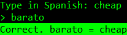
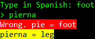

# Command Line Vocabulary Practice Tool

A simple command line vocabulary practice tool.

## Screenshots





## How to Add Words

1. Create a file named "Words.csv" in the same folder as the executable file.
2. On each line of the file write the word, the translation, and an optional note separated by commas in the following format: `[word],[translation],[note]` or `[word],[translation]`

### Words File Example
```CSV
barato,cheap
pie,foot
pierna,leg
espalda,back,body part
```